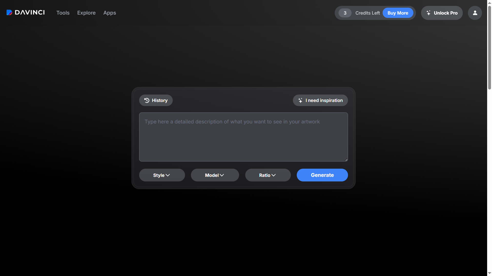
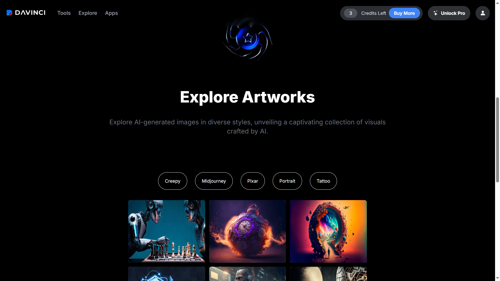
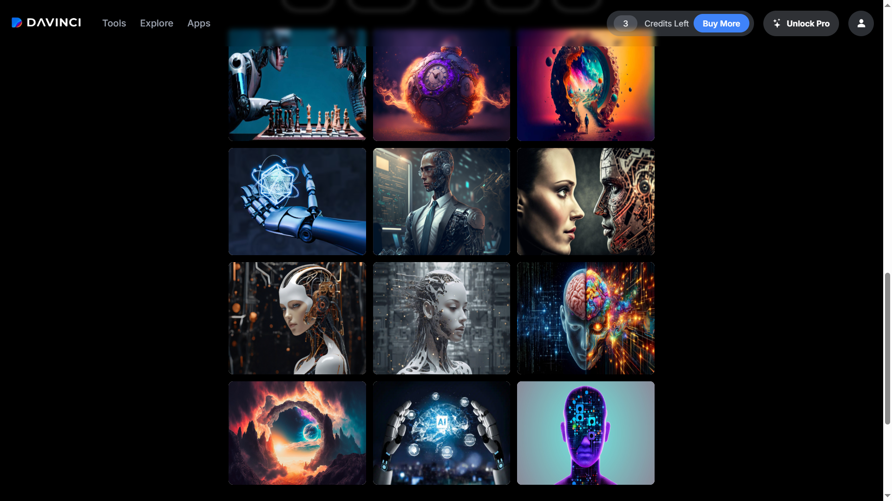
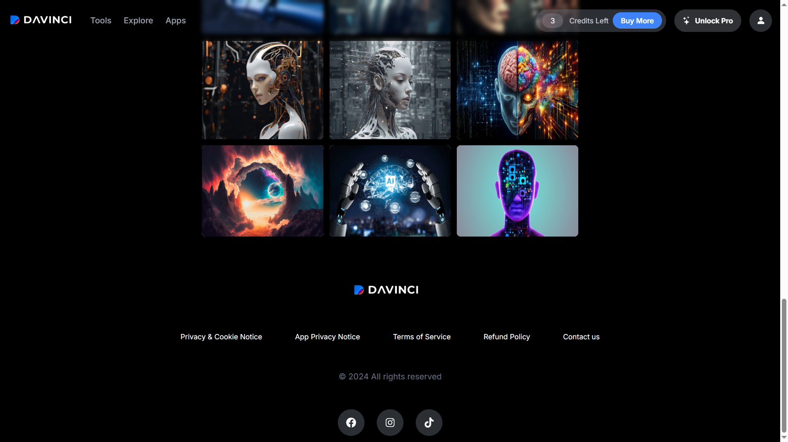

# 🎨 DAVINCI AI FRONT-END CLONE

> 🚀 Davinci AI görsel sanat platformunun modern frontend klonu (UI/UX odaklı proje)

---

## 🌐 PROJE LİNKLERİ

🔗 Live Demo: https://davinci-ai-front-end.vercel.app/

---

## 🧠 PROJE HAKKINDA

Bu proje, Davinci AI görsel sanat platformunun kullanıcı arayüzünü birebir yeniden oluşturmayı hedefleyen bir **frontend klon çalışmasıdır.**

👉 Amaç:
- Yapay zeka işlevlerini değil
- Sadece **UI / UX tasarımını ve kullanıcı deneyimini** yeniden inşa etmek

---
## 📸 SCREENSHOTS

| Davinci 1 | Davinci 2 |
|----------|----------|
|  |  |

| Davinci 3 | Davinci 4 |
|----------|----------|
| |  |

## ✨ ÖZELLİKLER

- 🎨 Davinci AI ilhamlı modern UI tasarımı
- 📱 Fully responsive yapı (mobil + desktop uyumlu)
- 🧭 Dinamik ve modern navbar
- ⚡ Hızlı ve akıcı sayfa deneyimi (Next.js avantajı)
- 🎯 Temiz ve kullanıcı dostu arayüz
- 🎥 React Player ile medya entegrasyonu
- 🧩 Component-based yapı

---

## ⚙️ KULLANILAN TEKNOLOJİLER

- ⚛️ ReactJS
- 🚀 Next.js
- 🎨 TailwindCSS
- 📦 React Icons
- 🎥 React Player
- 🪝 React Hooks (State Management)

---

## 🧠 PROJE YAPISI

```bash
src/
├── components/
│   ├── Cards.js
│   ├── Footer.js
│   ├── Generate.js
│   ├── Navbar.js


## 📱 RESPONSIVE YAPI

✔ Mobil uyumlu  
✔ Tablet uyumlu  
✔ Desktop uyumlu  

---

## 🧠 NOT

Bu proje sadece frontend klonudur.  
AI (yapay zeka) backend veya model içermez.

---

## 👨‍💻 GELİŞTİRİCİ

Ramazan Çiçekli  
GitHub: https://github.com/rcicekli  
LinkedIn: https://www.linkedin.com/in/rcicekli/

---

## ⭐ DESTEK

Projeyi beğendiysen ⭐ vermeyi unutma!
